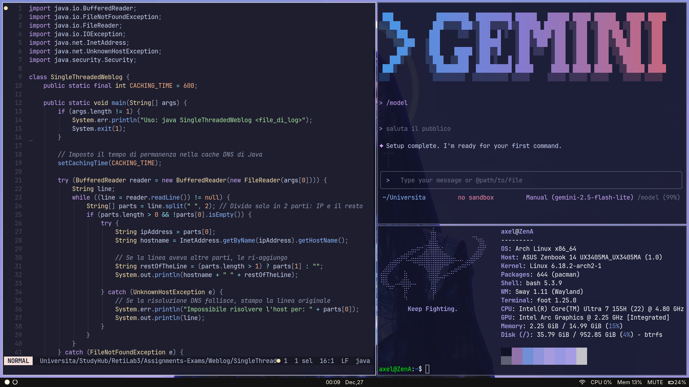
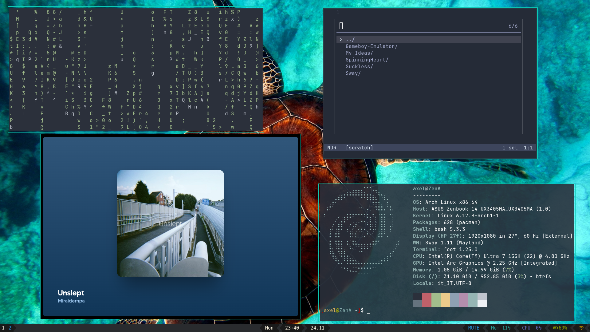
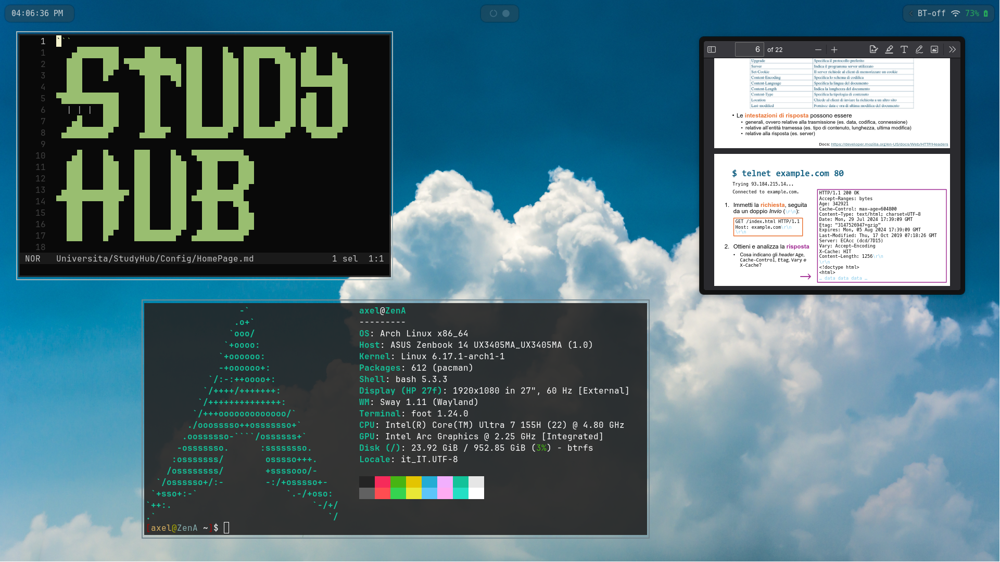
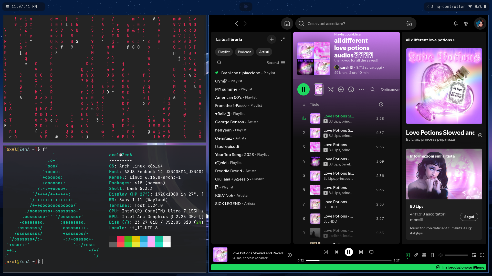
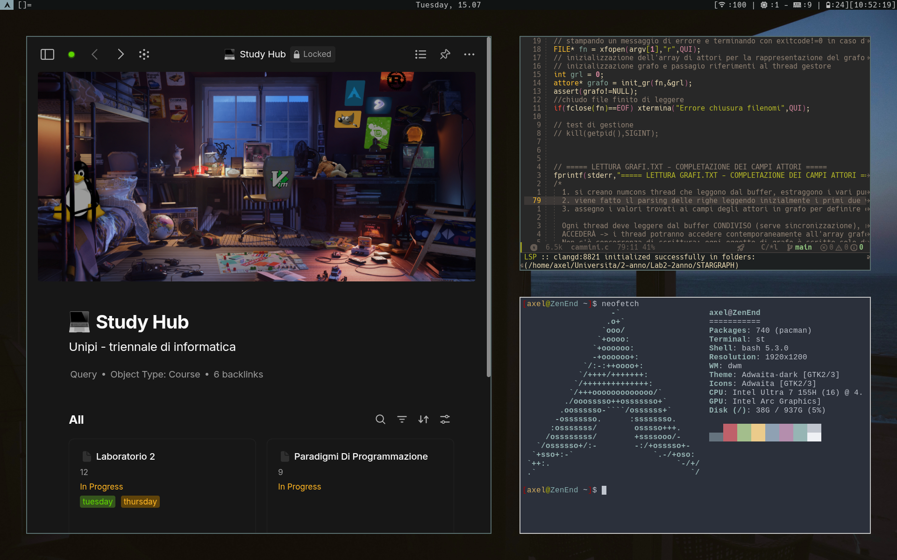

# Axel's Dotfiles

Welcome to my personal collection of configuration files for Arch Linux. This repository contains my custom "rice" and settings for various tools, ranging from Suckless utilities to modern Wayland compositors.

## 📸 Previews

Here are some snapshots of the setup:

  

  
More Screenshots

  
  ### Previous Iterations
  
  
  
  

## 🛠 Tools & Software

This repository includes configurations for:

- **Window Managers**: `dwm`, `sway`, `niri`
- **Terminals**: `alacritty`, `foot`
- **Editors**: `helix`
- **Utilities**:
  - `tmux` (Terminal multiplexer)
  - `tofi` (Launcher/Menu)
  - `waybar` (Status bar)
  - `dmenu` (Dynamic menu)
  - `slock` & `slstatus` (Suckless locking and status)
- **Others**: `fontconfig`

## 🚀 Installation

These dotfiles are organized to be easily managed. 

- **Standard Apps**: Most configurations reside in their respective folders and are meant to be linked or copied to `~/.config/`.
- **Suckless Tools**: Source code is provided for `dwm`, etc. You should enter each directory and run `make clean install` manually.

---
*Stay Minimal.*
